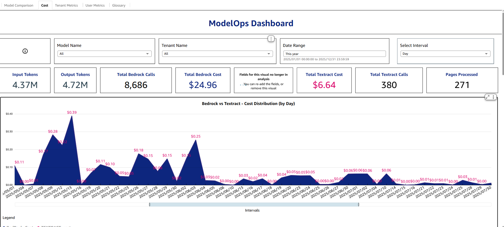

The Cost tab provides a consolidated view of token usage, API call counts, and associated costs for Bedrock and Textract services. It helps teams monitor expenses, optimize usage, and track cost distribution over time.

#### Navigate to *Cost* tab:

Click **Cost** located in the top banner of the QuickSight dashboard.

> ### Definitions

- **Input Tokens**:

    Represents the total number of input tokens processed across all models.

- **Output Tokens**:

    Represents the total number of output tokens generated by models.

- **Total Bedrock Calls**:

    Indicates the total number of API calls made to Bedrock models.

- **Total Bedrock Cost**:

    Shows the cumulative cost incurred for Bedrock model usage.

- **Total Textract Calls**:

    Displays the number of Textract API calls.

- **Total Textract Cost**:

    Indicates that cost data for Textract.

- **Pages Processed**:

    Represents the number of pages processed by Textract.

> ### Actions in Cost tab

??? info "To filter by the **Interval**"

    1. Click **Day** under the **Select Interval** tile.
    2. From the dropdown select the Interval required for the view.

        

    !!!note
        This filter will change the diagrams names and the properties based on the interval selection.

> ### Charts in Cost tab

The Cost tab provides a visual representation of expenses associated with AI model usage, enabling users to monitor and analyze cost trends over time. It includes a comparative view of Bedrock and Textract services, helping teams identify cost drivers, track daily fluctuations, and optimize resource allocation. The visualization offers interactive features such as hover-to-view details and timeline navigation for deeper insights.

#### **Bedrock vs Textract – Cost Distribution (by Day)**:

Bedrock vs Textract – Cost Distribution (by Day) displays comparision of daily cost distribution between Bedrock and Textract.

- Here the interval is selected as "**Day**" in the filter "**Select Interval**" tile.

.png)

- Identify cost spikes and usage patterns over time.
- Helps to compare cost drivers: LLM usage vs. document OCR.

#### **Bedrock Tokens vs Bedrock Cost (by Day)**:

Bedrock Tokens vs Bedrock Cost (by Day) displays daily input/output tokens (bars) vs Bedrock cost (line).

- Here the interval is selected as "**Day**" in the filter "**Select Interval**" tile.

.png)

- Helps diagnose whether prompt sizes (input) or response (output) are the main cost drivers.

#### **Textract Pages Processed vs Textract Cost (by Day)**:

Textract Pages Processed vs Textract Cost (by Day) displays daily pages processed (bars) vs Textract cost (line).

- Here the interval is selected as "**Day**" in the filter "**Select Interval**" tile.

.png)

- Connects volume to spend, enabling unit economics (cost/page).

- Ideal for capacity planning and throughput optimization.

#### **Cost by Model (by Day)**:

Cost by Model (by Day) displays the daily cost contribution of each model, allowing users to compare which models are driving expenses over time.

- Here the interval is selected as "**Day**" in the filter "**Select Interval**" tile.

.png)

- Enables cost tracking, trend analysis, and informed optimization decisions

#### **Cost by Tenant by Model**:

Cost by Tenant by Model displays the total cost per tenant, broken down by model, to show which tenants and models contribute most to overall expenses.

- Enables cost analysis, usage insights, and optimization strategies.

    