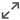
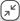
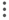
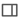
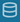
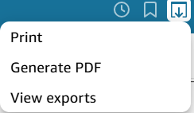

This section provides an overview of the tabs available in the ModelOps Monitoring dashboard and describes the key details presented in each.

!!!note
    The data available inside this dashboard refreshes on a daily basis.

## Actions across ModelOps Dashbaord

All dashboards are fully interactive. Users can click any chart or visualization to filter the data based on the selected value. When a filter is applied, all other visualizations on the dashboard update dynamically to reflect the selection, enabling drill-down analysis and deeper insights.

- To maximize a tile or diagram, click .
- To minimize a tile or diagram, click .
- To view the summary data of any tile in any tab, click  in the top right corner of the tile and select **View summary data**.
- To export the data of the tile to a csv formatted file, click  in the top right corner of the tile and select **Export to CSV**. the file will be downloaded automaticcally.
- To refresh a filter tile, click  in the top right corner of the tile and select **Refresh**.
- To reset a filter tile, click  in the top right corner of the tile and select **Reset**.
- Hover over any bar/line in the charts to view the exact details of that bar/line.
- Drag the navigation bar above the Timeline (Day) axis to display data for other days not currently shown.
- To pin any side panel, click  in the opened side panel.
- To unpin any side panel, click  in the opened side panel.

> ### Filter by the **Model Name**

1. Click **All** under the **Model Name** tile.
2. From the dropdown mark the checkbox next to the model name for the view.

    
!!!note
    - Click **Show selected** to see the selected models for the view.
    - All the models are selected by default.
    - To search a specific model fill the **Search value** field in the search box.

> ### Filter by the **Tenant Name**

1. Click **All** under the **Tenant Name** tile.
2. From the dropdown mark the checkbox next to the Tenant for the view.
    
    

!!!note
    - Click **Show selected** to see the selected tenants for the view.
    - All the tenants are selected by default.
    - To search a specific tenant fill the **Search value** field in the search box.

> ### Filter by the **Date Range**

1. Click **This year** in the **Date Range** tile. A filter window displays.
2. Select one of the following options:
    - **Relative date** – Filters data based on a relative time frame (e.g., this month, last 7 days).
    - **Absolute date range** – Filters data for a specific custom date range.

    

    1. **Relative date**: 
        1. Choose the time unit(Years, Quarters, Months, Weeks, or Days) from the dropdown menu.
        2. Based on the 1st step select one of the predefined options:
            - Previous [period] – Filters data for the last full period(e.g., previous month).
            - This [period] – Filters data for the current period(e.g., this quarter).
            - [period] to date or Till day  – Filters data from the start of the current period to today.
            - Last number of [period] – Enter a number (e.g., 31) to include the last mentioned number periods.
            - Next number of [period] –  Enter a number to include upcoming periods (useful for forecasting).***Need to check***
        3. Use **Exclude previous** to skip earlier periods
            1. Select the time frame to exclude (e.g., Months, Weeks) from the dropdown in **Exclude previous**.
            2. Enter the number of periods to exclude.

    2. **Absolute date range**:

        

        1. Enter the Start Date and Time in the left box (format: YYYY/MM/DD HH:mm:ss).
                
            OR

            Select the date in the calendar and update the time.

        2. Enter the End Date and Time in the right box (format: YYYY/MM/DD HH:mm:ss).

            OR

            Select the date in the calendar and update the time.

> ### Creating an automatic alert

1. Click  in the top right corner of a tile for which the alert needs to be created.
    The following page appears with the name and details of the tile selected.
    
    

2. Select **Condition**
    1. **Is above**  given Threshold
    2. **Is below** given Threshold
    3. **Is equal to** given Threshold
3. Fill the **Threshold** value.
4. Click the dropdown under **Notify me** to select the notification frequency.
5. Mark the checkbox next to "Email me when there is no data" to receive the data via email once the condition to the threshold is breached.
6. Click **SAVE**.

> ### Actions on the alerts

- To edit an alert:
    1. Click  next to the alert and select **Edit alert**.
    2. Update the details and click **SAVE**.

- To view history of an alert, click  next to the alert and select **View history**.

- To delete an alert, click  next to the alert and select **Delete**.

<!--
> #### Top banner of the dashboard

- To undo a filter applied to the dashboard, click .
- To redo a filter applied to the dashboard, click .
- To reset the view of the dashboard to the original state, click .
- To check scheduling, click . ***need info***
- To know which dataset is included in the dashboard, click .
- To fit the view of the dashboard to the screen, click , select the checkbox next to **Fit to window**.

> #### Bookmark a view of the dashboard

In the ModelOps dashboard, the user can set a bookmark as per their requirement.

To bookmark view of the dashboard follow the steps below:

1. Open the required tab (eg. Model Comparison, Cost, Tenant Metrics etc.) and filter the data as per the need.
2. Once the dashboard is ready, in the top right corner of the page, click .
3. Click **+ ADD** icon in the **Bookmarks** panel.
4. Fill the **Bookmark name** field as per the need.
5. Click **Save**. The bookmarks saved will be shown in the list inside **Bookmarks** panel.

!!!note
    A maximum of 200 bookmarks can be saved per dashboard.

> ##### Set a bookmark as default view of the dashboard

To make a bookmark as the default view follow the steps below:

1. In the top right corner of the page, click .
2. Click  next to the bookmark name that needs to be set as the default page.
3. Select **Set as default** from the menu. The view is set as default.

> ##### Actions on Bookmark

- To refresh the details of a bookmark, Click  next to the bookmark name and select **Update**.

- To rename a bookmark
    1. Click  next to the bookmark name and select **Rename**.
    2. Enter the new name needed in the box under **Bookmark name** and click **SAVE**.

- To delete a bookmark 
    1. Click  next to the bookmark name and select **Delete**.
    2. A pop-up menu will be displayed, click **YES, DELETE BOOKMARK**. The bookmark will be deleted.

!!!note
    The "**Original dashboard**" bookmark cannot be updated, renamed, or deleted.

> #### Exporting the data shown in the displayed screen

The users have two options to export the displayed data from the dashboard.

1. **Print**: Select this option if you want to customize the paper size and orientation.

    OR

2. **Generate PDF**: ModelOps automatically generates the PDF file in the downloadable format.

Steps to export the data by ***Print*** option:

1. In the top-right corner of the dashboard, click  icon.
2. Click **Print** icon form the menu.
 
    

3. The Prepare for printing pop-up menu displays.

    

4. Click the box under **Paper size** and select the required paper size from the dropdown.
5. Click the box under **Paper orientation** and select the required orientation from the dropdown.
6. Select the checkbox near **Print background color** to keep the background color of the displayed data.
7. Click **GO TO PREVIEW**, The **Preview (Ready to print)** page appears.

    

8. If all the data is generated successfully in the dashboard the **PRINT** icon enables in the top-right corner of the page.
9. Click **PRINT**, the print pop-up window displays. Select the required options and click **Print**.

Steps to export the data by ***Generate PDF*** option:

1. In the top-right corner of the dash board, click  icon.
2. Click **Generate PDF** icon from the menu.

    

3. An info icon will be displayed with a message **"Working on your PDF file."**, click **VIEW EXPORTS** to see the progress.
4. Once the file is prepared a success message will be displayed mentioning **"Your PDF is ready."**, click **DOWNLOAD** to download the PDF file.

!!!info
    - To view the list of the exported data, click  and select **View exports**.
    - To download the previously created data again:
        1. Click  and select **View exports**.
        2. Click **Click to download**.

> #### Creating an automatic alert

1. Click  in the top right corner of the dashboard. The **Create alert** panel opens on the right side of the dashboard.

    OR

    Click  in the top right corner of a tile for which the alert needs to be created.

2.  Select the **Visual on this sheet** from the dropdown menu and click **NEXT**.
3. Select **Condition**
    1. **Is above**  given Threshold
    2. **Is below** given Threshold
    3. **Is equal to** given Threshold
4. Fill the **Threshold** value.
5. Select the notification frequency.
6. Mark the checkbox next to "Email me when there is no data" to receive the data via email.
7. Click **SAVE**.

> ##### Actions on the alerts

- To edit an alert:
    1. Click  next to the alert and select **Edit alert**.
    2. Update the details and click **SAVE**.

- To view history of an alert, click  next to the alert and select **View history**.

- To delete an alert, click  next to the alert and select **Delete**.

ADD SHARE OPTION IF UPDATED IN FUTURE.

-->