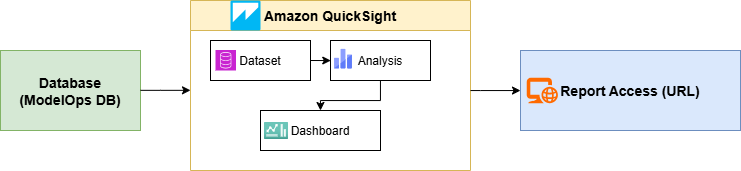

The ModelOps reporting system provides comprehensive visibility into model performance, operational health, and resource utilization. It integrates **Amazon QuickSight** for visualization and uses data stored in ModelOps databases to generate dashboards and analyses.

### Architecture Overview

The reporting workflow follows this sequence:

Database → Dataset → Analysis → Dashboard → Report Access (URL)

- **Database**: Metrics and metadata are stored in ModelOps databases.
- **Dataset**: Custom SQL queries aggregate data from multiple tables.
- **Analysis**: QuickSight analyses are created using datasets.
- **Dashboard**: Visual dashboards present key metrics and trends.
- **Report Access (URL)**: Dashboards are shared via secure URLs.

### Environment Details

- Development Database: modelops
- QA Database: modelopsqa

!!!note
    Both environments reside on the same server but use separate databases.

#### QuickSight Account Considerations

- **Same QuickSight Account for Dev and QA**:
    No migration is required. Dashboards, datasets, and analyses are accessible within the same account. Use versioning or environment-specific datasets for management.

- **Different QuickSight Accounts for Dev and QA**:
    A migration process is required to replicate dashboards, datasets, and analyses across environments.

### Tables Used in Reporting
The following tables are queried to generate reporting datasets:

- Request_metrics
- AI_model
- User
- Tenant
- Model_pricing

### Custom SQL Query
A custom SQL query was developed to join these tables and retrieve all required columns.

**Columns Included**:

- **Request Details**: Id, UUID, Retry_counts, CreatedTS
- **Input/Output Metrics**: Inputsize, Outputsize, Prompt_tokens, Completion_tokens
- **Performance Metrics**: Invocation_latency, Wait_duration, Processing_duration
- **Document Details**: Content_length, Page_count, Document_type
- **Status and Errors**: Status, Error_code, Error_message, Cancellation_Status, CancellationTS
- **Identifiers**: User_id, Model_id, Tenant_id
- **Names**: User_Name, Tenant_Name, Model_name
- **Cost Metrics**: BedRock_Cost
- **Method Type**: Method_type

