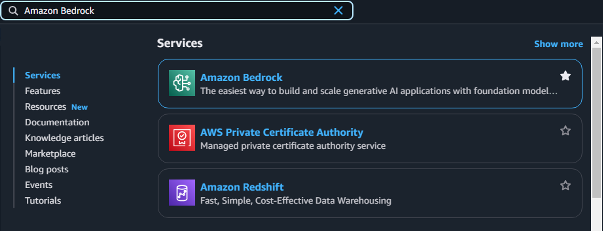
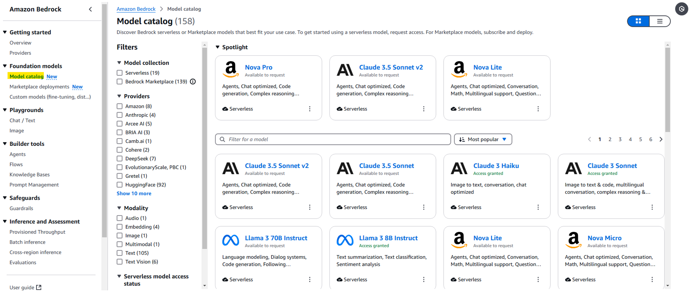
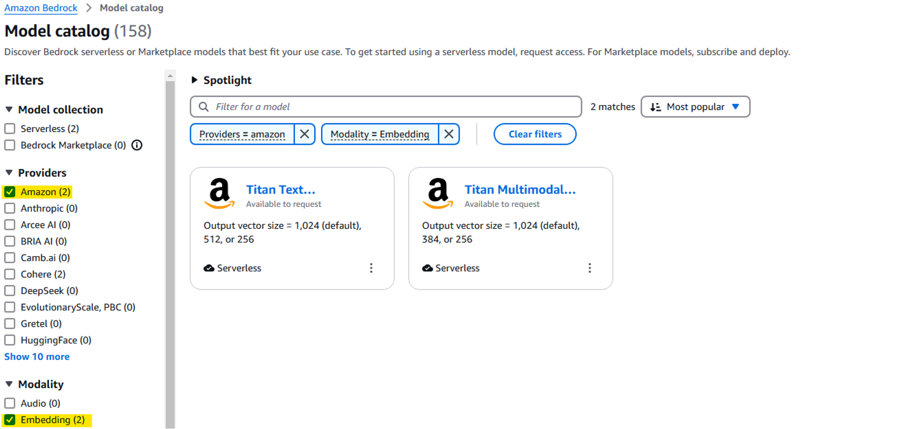
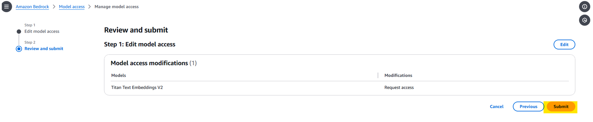
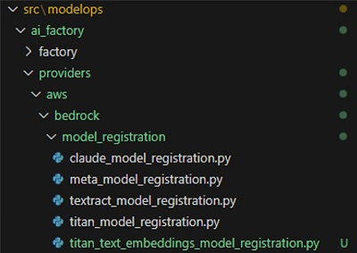
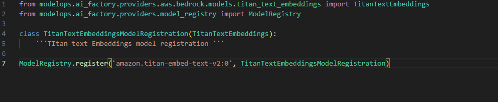

## Model Admin APIs Overview

ModelOps provides a set of admin-level APIs that allow platform administrators to manage AI model access and metadata across tenants. These APIs are essential for provisioning, updating, and decommissioning models in a secure and controlled manner.

>### Onboarding a Model API

**Purpose**:

This API allows ModelOps administrators to onboard a model.

> #### Onboarding a Pre-Existing Model Available in ModelOps

If the foundational model is already listed in ModelOps, onboarding is straightforward and involves invoking the designated API endpoint

**Endpoint**:

`/v1/admin/modelops/model/{{model_id}}`

**Request**:

Send a POST request to the given endpoint.

   - Header:
     - `Authorization`: Insert the Bearer token.

   - Path parameter:
     - `model_id`: Insert the model ID.


**Response**:

```json
{
  "message": "Model onboarded successfully",
  "modelId": "amazon.titan-text-lite-v1",
  "active": true,
  "service": "TEXT"
}
```

**Error Responses**:

| HTTP Status | Message | Description |
|-------------|---------|-------------|
|400|xxxxxx already exists| The given model is already onboarded.|
|404|xxxxxxx does not exist| Given model does not exist in database, onboard the new model manually and try again to onboard here.|

>#### Onboarding a New Model to ModelOps

If the model is not yet available in ModelOps, follow these steps:

**Step 1**: Enable Model in AWS Bedrock Console

1. Login to AWS Console.
2. Navigate to Amazon Bedrock via the search bar.

    

3. Go to **Foundation Models** > **Model Catalog**

    

4. Apply filters to select the desired provider (e.g., Amazon, Anthropic) and select the required model.

    

5. Navigate to **Model Access** under **Bedrock configurations**.

    


6. Click **Available to request**.

    

7. Click **Request model access**. The following page will appear.

    

    !!!note
        Do not uncheck existing models during the access request process.

8. Click **Submit**

    


**Step 2**: Onboard Model via ModelOps API

Once access is granted, the model will be available in the ModelOps. It can be onboarded to ModelOps. Call the API end point `/admin/modelops/model/{model_id}`. To know more about the API refer [Onboarding a Pre-Existing Model Available in ModelOps](#onboarding-a-pre-existing-model-available-in-modelops)

    - Use the new model ID from the aws bedrock catalog.
    

**Step 3**: Development Work (Post-Onboarding)

After onboarding, developers must implement model-specific logic in the ModelOps codebase.

Contact ModelOps developer team to complete this step.
<!-- 
1. Capture Model-Specific Request Format
  
    - Refer to the **Usage** section in the AWS Bedrock model catalog.
    - Identify the input and output structure required by the model.

2. Create Model Class

    - Path: `ModelOps/src/modelops/ai_factory/providers/aws/bedrock/models`
    - Navigate to ModelOps repo and create a new class named after the model.
    
    - Inherit from the base AWS Bedrock class.
    
    - Implement and override:
        - `construct_body()`: Build the input request. (Refer the above image)
        - `construct_response()`: Format the output as per ModelOps standards

    Example reponse body:

    ```json
        "content": [
    {
      "type": "text",
      "text": "..."
    }               ]
    ```

3. Register Model Class

    - Path: `ModelOps/src/modelops/ai_factory/providers/aws/bedrock/model_registration`
    - Create a new registration class (filename should end with _registration).
    
    - Inherit the model class created earlier. (Refer the image below.)
    - Register with `ModelRegistry` using:
        - Exact model ID
        - ModelOps identifier
        
        

4. Initialize Registration

    - Path: `ModelOps/src/modelops/ai_factory/ai_factory.py`
    - Import the registration class to ensure it is initialized.
    
-->
>### Updating a Model API

**Purpose**:

This API allows ModelOps administrators to update the `maxToken` of a model.

**Endpoint**:

`/v1/admin/modelops/model`

**Request**:

Send a PATCH request to the given endpoint.

   - Header:
     - `Authorization`: Insert the Bearer token.

```json
{
  "modelId" :"amazon.titan-text-lite-v1" ,
  "maxToken": 4096
}
```
!!!Note
    To know more about the model ID and Model Name, refer [Model details](../StarterKit/Model%20Invocation%20APIs.md#model-reference-table)

**Response**:

```json
{
    "modelId": "amazon.titan-text-lite-v1",
    "active": true,
    "service": "TEXT",
    "maxToken": 4096,
    "modelInfo": {
        "modelArn": "arn:aws:bedrock:ap-south-1::foundation-model/amazon.titan-text-lite-v1",
        "modelId": "amazon.titan-text-lite-v1",
        "modelName": "Titan Text G1 - Lite",
        "providerName": "Amazon",
        "inputModalities": [
            "TEXT"
        ],
        "outputModalities": [
            "TEXT"
        ],
        "responseStreamingSupported": true,
        "customizationsSupported": [],
        "inferenceTypesSupported": [
            "ON_DEMAND"
        ],
        "modelLifecycle": {
            "status": "ACTIVE"
        }
    }
}
```

**Error Responses**:

| HTTP Status | Message | Description |
|-------------|---------|-------------|
|400|Max tokens must be between 1 and 4096 for amazon.titan-text-lite-v1.|Max token value given is not in the range.|
|404|xxxxx not found| The given model id is wrong, check it.|

>### Deboarding a Model API

**Purpose**:

This API allows ModelOps administrators to deboard a model.

**Endpoint**:

`/v1/admin/modelops/model/{{model_id}}`

**Request**:

Send a DELETE request to the given endpoint.

   - Header:
     - `Authorization`: Insert the Bearer token.

   - Path Parameter:
     - `model_id`: Insert the model id which is to be deboarded.


**Response**:

```json
{
  "modelId":"amazon.titan-text-lite-v1",
  "active":false,
  "service":"TEXT"
}
```

**Error Responses**:

| HTTP Status | Message | Description |
|-------------|---------|-------------|
|404|xxxx does not exist.| The given model name is not available in database. check and try again.|


!!!note
    Deboarding does not delete the backend resources immediately. Admin can onboard a deboarded resource within 15 days.